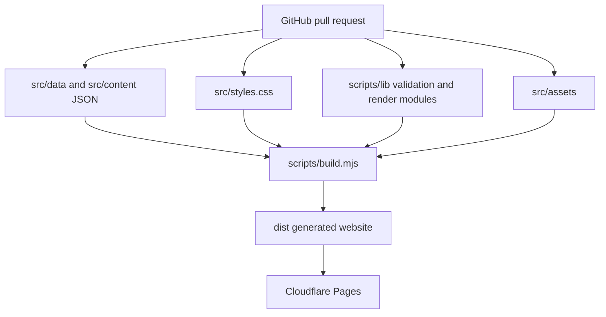

# Architecture

Hiligaynon 101 is intentionally simple, static and reviewable.

## Goals

- No database
- No CMS
- No user accounts
- No paid backend dependency
- No client-side framework required for launch
- Content committed as JSON and rendered into static files

## System Map



## Build

`scripts/build.mjs` is the orchestration entrypoint. It reads source JSON, validates content, defines the routes to render, copies static assets and writes:

- `dist/index.html`
- one generated detail page for each book path in `src/content/books.json`
- `dist/affiliate-disclosure/index.html`
- `dist/contact/index.html`
- `dist/privacy/index.html`
- `dist/styles.css`
- `dist/sitemap.xml`
- `dist/robots.txt`

The build helpers live under `scripts/lib/`:

- `html.mjs`: escaping, compact text and JSON-LD script helpers
- `urls.mjs`: site origin, route URLs and asset URL helpers
- `books.mjs`: featured-edition and edition-order helpers
- `schema.mjs`: metadata and structured data generation
- `render-home.mjs`: homepage component and page rendering
- `render-book-page.mjs`: generated detail pages for individual books
- `render-info-page.mjs`: simple footer/legal pages
- `validation.mjs`: source content validation before rendering

Routes are represented as a small route list in `scripts/build.mjs`. The route list includes the homepage, all book paths from `src/content/books.json`, and simple footer/legal pages. Sitemap generation uses the same route list.

Most book cover images are referenced per edition in `src/content/books.json` using Amazon image URLs resolved from each Amazon ASIN. The locally tracked cover images in `src/assets/` are used for the custom social preview image. Edition records also keep separate Amazon and Amazon AU short links so more markets can be added later without changing the card layout.

`scripts/check.mjs` verifies that the generated site has core SEO metadata, edition data, no empty local links and no obvious draft markers.

## Content Validation

The build fails before rendering if required content is missing or inconsistent. Current validation checks:

- required site metadata, navigation and social image asset path
- unique book and edition IDs
- unique book paths ending with `/`
- featured edition IDs that match real editions
- required Amazon URLs, ASINs and cover image URLs
- exactly nine sample words for the current 3x3 word grid
- 5 to 10 adult beginner phrase samples with audio-ready keys
- non-empty FAQ questions and answers

`scripts/check.mjs` remains the generated-output smoke test after rendering.

## Social Preview Asset

The Open Graph/Twitter preview uses `src/assets/social-preview.png`, with `src/assets/social-preview.svg` kept as the editable source. The SVG references the tracked source cover images in `src/assets/`.

When the preview needs to change, update the SVG and regenerate the PNG at 1200x630 before opening a PR. The build copies `src/assets/` into `dist/assets/`.

## Deployment

Use Cloudflare Pages with:

```txt
Build command: node scripts/build.mjs
Build output: dist
```

The production URL should be `https://hiligaynon101.com`.
