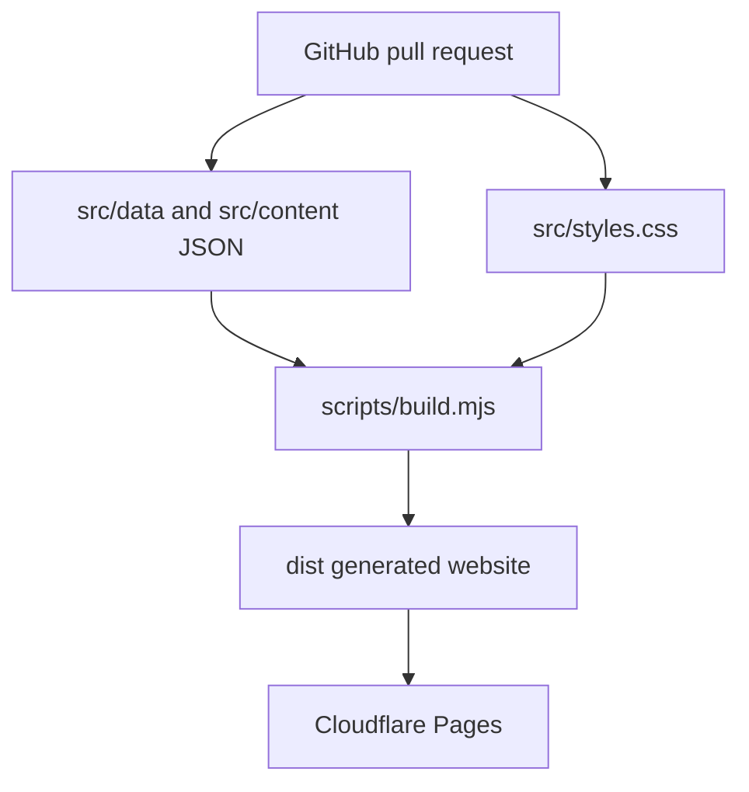

# Architecture

Hiligaynon 101 is intentionally simple, static and reviewable.

## Goals

- No database
- No CMS
- No user accounts
- No paid backend dependency
- No client-side framework required for launch
- Content committed as JSON and rendered into static files

## System Map



## Build

`scripts/build.mjs` reads source JSON and renders:

- `dist/index.html`
- `dist/styles.css`
- `dist/sitemap.xml`
- `dist/robots.txt`

Book cover images are not committed as local assets. They are stored per edition in `src/content/books.json` using Amazon image URLs resolved from each Amazon ASIN. Edition records also keep separate Amazon and Amazon AU short links so more markets can be added later without changing the card layout.

`scripts/check.mjs` verifies that the generated site has core SEO metadata, edition data, no empty local links and no obvious draft markers.

## Deployment

Use Cloudflare Pages with:

```txt
Build command: node scripts/build.mjs
Build output: dist
```

The production URL should be `https://hiligaynon101.com`.
